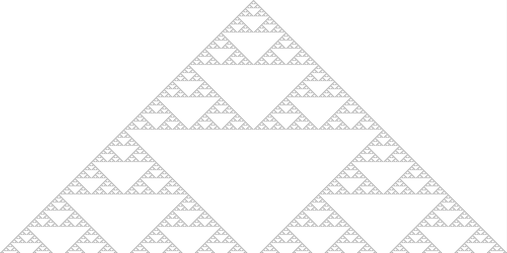
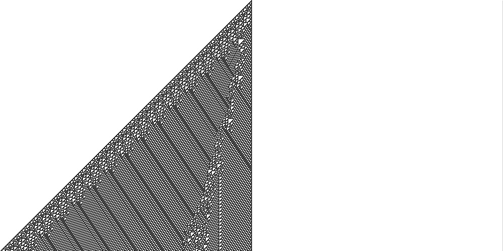

# Parallel-Cellular-Automata
Serial and parallel Elementary Cellular Autometa (ECA) is implemented with MPI. This is a good practice and introduction to do some synchronous computing.

It should be noted that in the written code, each processor is working on its own part of CA and at the end of processing, the results are stacked together for creating the final CA figure. Finally, OpenCV was used to visualize the produced image by concatination of all iterations.

Figures below show two intresting images produced by rule 110 and 18.

## Rule 18 of ECA

## Rule 110 of ECA

